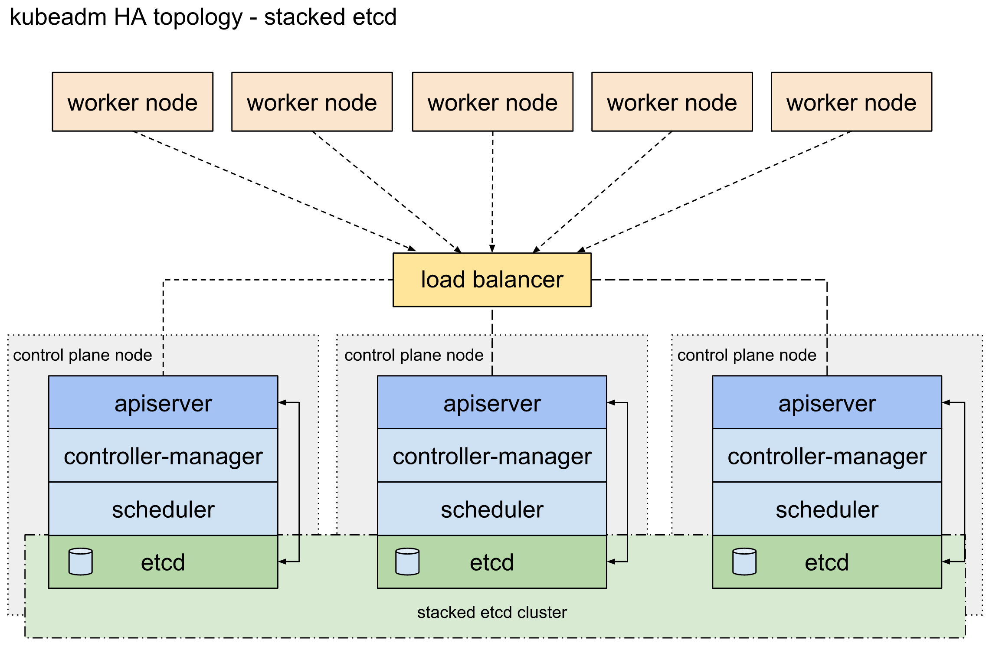
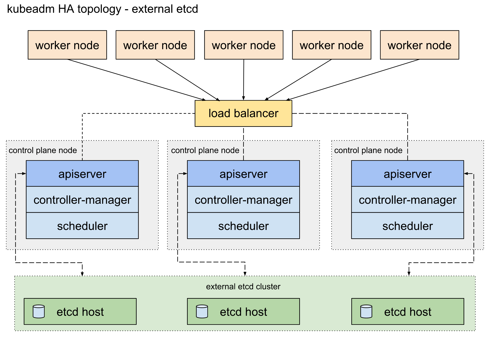

## kubeadm による HA Clusters の構築
### 1. 前提条件
  - Linux（ここでは Ubuntu 20.04 LTS を使用）
    - Raspberry PI 4 でも可能 
  - CRI 準拠のコンテナエンジンがインストールされている（Dockerなど） 
    - [Docker のインストール](https://kubernetes.io/ja/docs/setup/production-environment/container-runtimes/)
    - 少し下にスクロールするとある
  - kubeadm, kubelet, kubectl がインストールされている 
    - [kubeadm のインストール](https://kubernetes.io/ja/docs/setup/production-environment/tools/kubeadm/install-kubeadm/)
  - swap が off になっている 
    - `# swapoff -a & free` → 以下の様に Swap が 0 になっていることを確認する
<pre>
              total        used        free      shared  buff/cache   available
Mem:        6085584      511076     3799944        1280     1774564     5359340
Swap:             0           0           0
</pre>
  - 各マシンが互いに名前解決できる（/etc/hosts）
    - IP で直接設定していする場合は必要ない 
  - 各マシンが通信可能
  - 各マシンの時間が同期されている
```
sudo vi /etc/systemd/timesyncd.conf # NTP=ntp.nict.jp を追加
sudo systemctl restart systemd-timesyncd.service 
```
  - cgourp-driver: kubelet, docker ともに systemd を前提とする
    - kubelet は kubeadam を使うと Default で systemd になる 
    - Docker の Default は cgroupfs だが Multi Cluster 構築のときに kubeadm でエラーになるので systemd に変更
```
kubectl apply -f https://docs.projectcalico.org/v3.14/manifests/calico.yaml
```
  - 基本的に作業は全て root で行っている（一部 user とは作業が異なる）
```
sudo passwd root
```
### 2. HA Clusters 構成（２部構成） 
今回は前者（Stacked etcd）の構成を取る




### 3. High Availability/HA Clusters 環境の構築手順
1. Create LB : ロード バランサ 
2. Create Basic Control-Plane Node : 基本の Control-Plane (Master) 
3. Install CNI : CNI のインストール 
4. Create Another Control-Plane Nodes : その他の Control-Planes 
5. Create Worker Nodes : ワーカー ノード 
#### 1. Create LB
HAProxy のインストール
```
apt update 
apt install haproxy 
```
以下のコマンドで動作チェック 
```
nc -v <IP of LB> 6443 
```
エラーが発生したとき以下のコマンドで調査 
```
journalctl -u haproxy.service --since today --no-pager 
```
#### 2. Create Basic Control-Plane Node : 基本の Control-Plane (Master) 
- `kubeadm init --config *.yaml` → この書式では HA Clusters 用の出力がなされないので以下の書式を使う
```
kubeadm init --control-plane-endpoint <IP of LB>:6443 --upload-certs
```
- 2時間で証明書が無効になるので、そのときは以下のコマンドを使う
```
kubeadm init phase upload-certs --upload-certs 
```
- 二通りの kubeadm join が出力されるのでコピーしておく 
  - 上は Control-Plane (Master) を登録するときに使用 
  - 下は Worker Node を登録するときに使用
- KUBECONFIG 環境変数を設定 
```
export KUBECONFIG=/etc/kubernetes/admin.conf
```
#### 3. Install CNI : CNI のインストール 
- `kubectl get nodes` → Ready になっていることを確認 
- エラーが発生したときは以下のコマンドで環境をチェック
```
nc -v &lt;IP of LB&gt; 6443 
Connection to <IP of LB> 6443 port [tcp/*] succeeded! → このメッセージが出力されると成功 

systemctl restart kubelet → 全ての Control-Plane 上で 
systemctl restart haproxy → haproxy をインストールしたマシン上で 
```
#### 4. Create Another Control-Plane Nodes : その他の Control-Planes
- kubeadm init の出力でコピーした上の kubeadm join を該当するマシン上で実行する 
- 事前に前提条件をすべて満たしておくこと（kubectl は使えない） 
- Option に --control-plane --certificate-key があることを確認 
- コピーしたコマンドを Worker Node 上のマシンで動かす 
<pre>
# kubeadm join …（以下省略）
</pre>
- Control-Plane 上で join できたかを確認する → STATUS: Ready になっていることを確認
<pre>
# kubectl get nodes
</pre>
#### 5. Create Worker Nodes : ワーカー ノード 
- kubeadm init の出力でコピーした下の kubeadm join を該当するマシン上で実行する
- 事前に前提条件をすべて満たしておくこと（kubectl は使えない）
- Option に ---control-plane --certificate-key がないことを確認
#### その他
- 動作確認（Control-Plane）
<pre>
kubectl get nodes      # STATUS: Ready 
kubectl get pods –A    # STATUS: Running 
</pre>
- 環境のリセット
<pre>
# rm -rf /etc/kubernetes/* 
# rm -rf /var/lib/etcd/* 
# kubeadm reset
</pre>
